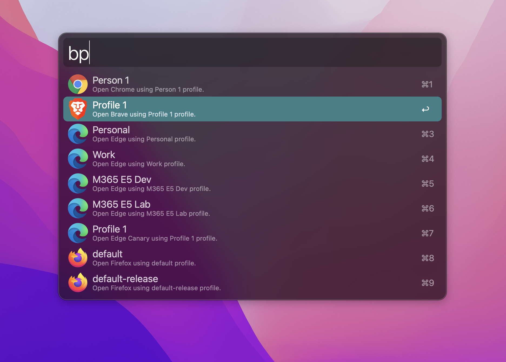

# Browsers Profiles for Alfred
> Open your browsers profiles from Alfred

## Installation
1. download latest version from [releases](https://github.com/skydiver/alfred-browsers-profiles/releases) section
2. open download `.alfredworkflow` file

## Usage
1. activate Alfred
2. type `bp` or `bp <your profile>`

## Supported Browsers
* Chrome
* Chrome Canary
* Chromium
* Brave
* Edge
* Edge Canary
* Firefox
* Firefox Developer Edition

## Screenshot

